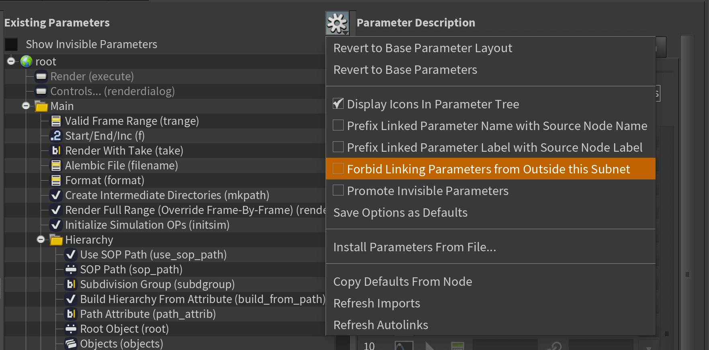
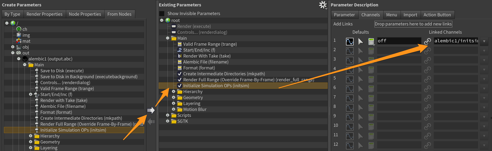

# How to update the Alembic node properties

With new releases for Houdini, new properties get added to the Mantra node, and some get taken away.
These step will guide you through the process of updating the otl file.

1. Ensure you have locally cloned this repo, and then set the `tk-houdini-alembicnode` location in your config to point at the local repo using a dev descriptor.

2. Launch Houdini from Shotgun using the Houdini version you wish to check for parameter updates on.

3. Open a new scene on a Shot or an Asset using Workfiles.

4. Run the following script in the Houdini Python shell.
    ```python
    import hou
    import pprint

    rop = hou.node('/out')
    alembic_node = rop.createNode('alembic')

    sgtk_alembic_node = rop.createNode('sgtk_alembic')

    alembic_props = set([str(p.name()) for p in alembic_node.parms()])
    sgtk_alembic_props = set([str(p.name()) for p in sgtk_alembic_node.parms()])
    diff = alembic_props - sgtk_alembic_props

    pprint.pprint(diff)
    ```
    This should create a standard Mantra node and sgtk Mantra node, and print out the list of properties that the sgtk node is missing.

5. Now select the sgtk Alembic node from the `out/` network.

6. In the parameter window for the selected node, click on the cog icon, just to the right of the node name, and choose "Type properties..."

7. In the newly opened Window, make sure you are in the parameters tab. Now it's time to add any missing parameters
highlighted when running the script over from the left side to the right side. You will probably need to transfer the properties from a standard alembic node to your sgtk one. To do this, first disable this setting:

Then you should move the missing parameters over to the sgtk node into the correct place in the structure, and also adjust the channel to repath it from `/out/alembic1` to `alembic1`:


8. Once you've added the new parameters, return to the Python shell and run these two lines.
    ```python
    diff = sgtk_alembic_props - alembic_props
    pprint.pprint(diff)
    ```
    This will give you the parameters that are in the sgtk node and not the standard node. You should consider removing any none sgtk nodes.

9. Now you are done, you can accept and apply the changes. Check that the new parameters show up in the node interface and commit your changes. Make sure not to commit the backup otls that Houdini generates.

You also need to repeat these steps for the sgtk_alembic_sop.otl, that can be created inside an object.
create a cube in obj/ and then double click the cube node and create an sgtk and rop_alembic node and compare the two.
